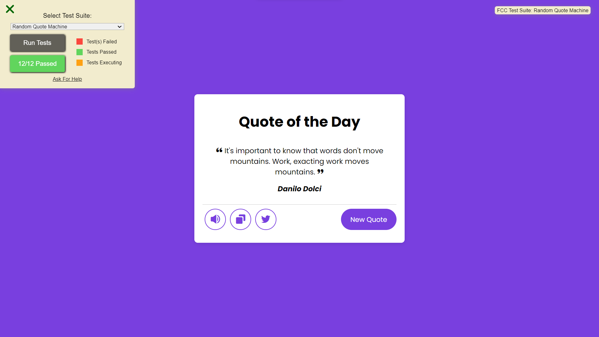

# Random Quote Machine

This is a project developed as part of the FreeCodeCamp certification. The goal of this project is to create an application that displays random quotes and meets the following user story criteria:

## User Stories

1. I can see a wrapper element with the corresponding id "quote-box".
2. Within #quote-box, I can see an element with the corresponding id "text".
3. Within #quote-box, I can see an element with the corresponding id "author".
4. Within #quote-box, I can see a clickable element with the corresponding id "new-quote".
5. Within #quote-box, I can see a clickable element with the corresponding id "tweet-quote".
6. On first load, my quote machine displays a random quote in the element with id "text".
7. On first load, my quote machine displays the random quote's author in the element with id "author".
8. When the #new-quote button is clicked, my quote machine should fetch a new quote and display it in the #text element.
9. My quote machine should fetch the new quote's author when the #new-quote button is clicked and display it in the #author element.
10. I can tweet the current quote by clicking on the #tweet-quote element. This element should include the "twitter.com/intent/tweet" path in its href attribute to tweet the current quote.
11. The #quote-box wrapper element should be horizontally centered.

## Technologies Used

- React
- CSS Modules
- JavaScript

## Additional Features

In addition to the functionalities required by FreeCodeCamp, two additional features have been added:

1. **Copy to Clipboard**: The ability to copy the current quote to the user's clipboard has been added for easy sharing of the quote.

2. **Text-to-Speech**: The application allows the text of the quote to be read aloud, providing an enhanced user experience for visually impaired individuals or those who prefer to listen to the quote instead of reading it.

## How to Run the Project

You can run the project by following this link: [Project Link](https://freecodecamp-random-quote-rho.vercel.app/)

I hope you enjoy the experience of our Random Quote Machine!
